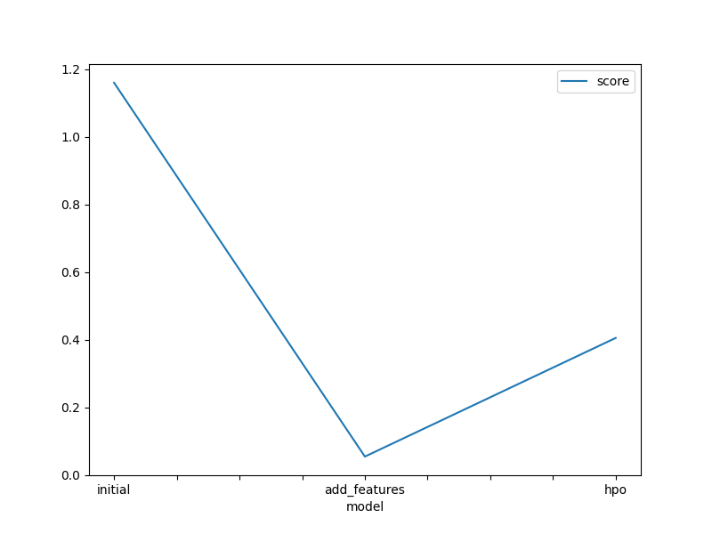
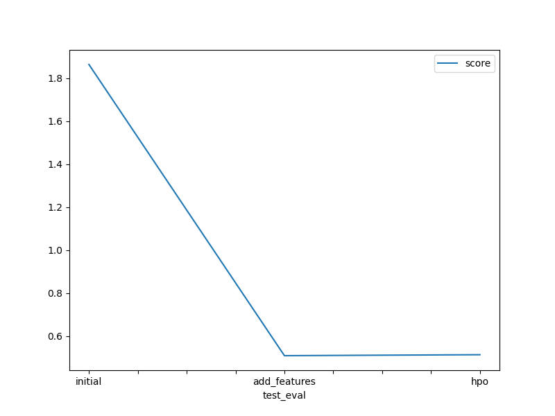

# Report: Predict Bike Sharing Demand with AutoGluon Solution
#### Margaret Gathoni

## Initial Training
### What did you realize when you tried to submit your predictions? What changes were needed to the output of the predictor to submit your results?
The predictions needed not to be in negatives so i had to change all neagtives to zeros.

### What was the top ranked model that performed?
The top ranked model was WeightedEnsemble_L2

## Exploratory data analysis and feature creation
### What did the exploratory analysis find and how did you add additional features?
I managed to derive from the distriutions that the temperature categories were normally distributed. The datetime needed to be split into more features and I chose to split it into year, month, day and hour which is what improve my model the most. About the season I suppose that we see the four seasons in the distribution and it is the same for the weather which has three categories of input. Workday and holiday are both binary fields and humidity and windspeed are left and right skewed respectively.

### How much better did your model preform after adding additional features and why do you think that is?
The best improvement was because of the split of the datetime field into year, month, day and hour and the result in based in my opinion on the. there was great improvement from 1.67 rmse to 0.54

## Hyper parameter tuning
### How much better did your model preform after trying different hyper parameters?
The model performed much better than the initial model but a little bit worse than the improvement with just the features.

### If you were given more time with this dataset, where do you think you would spend more time?
I would try to figure out more ways to improve on the features as they seem to be the ones that lead to improvement of the score.

### Create a table with the models you ran, the hyperparameters modified, and the kaggle score.
model	timelimit	presets	hp-method	score
0	initial	time_limit = 600	presets='best_quality'	none	1.86412
1	add_features	time_limit=600	presets='best_quality'	problem_type = 'regression'	0.50886
2	hpo	time_limit=600	presets='best_quality'	tabular autogluon	0.51338

### Create a line plot showing the top model score for the three (or more) training runs during the project.

TODO: Replace the image below with your own.

### Create a line plot showing the top kaggle score for the three (or more) prediction submissions during the project.

TODO: Replace the image below with your own.

## Summary
the autoglaun model was fun
